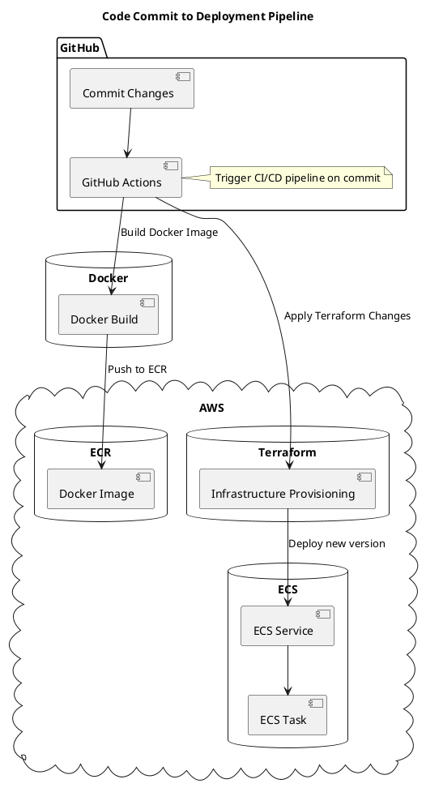

# Swoom Assigment Application Deployment

## Table of Contents
1. Introduction
2. Design and Architecture
3. Technology Decisions and Rationale
4. Installation Guide
5. Architecture Diagram
6. Conclusion

---

## 1. Introduction
Welcome to the Swoom Assignment Application deployment guide. This repository encapsulates a Flask-based web service, seamlessly containerized using Docker, and provisioned on AWS with infrastructure-as-code practices using Terraform and orchestrated through GitHub Actions.

---

## 2. Design and Architecture

The application is architected to be resilient, scalable, and maintainable. Key components include:
- **Application**: A Flask-based web service.
- **Containerization**: Docker ensures application consistency across environments.
- **Orchestration**: AWS ECS with Fargate for serverless container execution.
- **Load Balancing**: AWS Application Load Balancer distributes incoming traffic.
- **Infrastructure Management**: Terraform modules manage AWS resources, ensuring modular and reproducible infrastructure.
- **CI/CD**: GitHub Actions for automating build and deployment processes.

---

## 3. Technology Decisions and Rationale

### Terraform
- **Reproducibility**: Define infrastructure using a declarative language, minimizing drift and human error.
- **Extensive AWS Support**: Comprehensive coverage of AWS resources.
- **Modularity**: Clean separation of concerns using Terraform modules.

### Docker and AWS Fargate
- **Consistent Runtime**: Ensure the application environment is consistent.
- **Serverless Operation**: Remove the need to manage underlying EC2 instances.
- **Scalability**: Seamlessly scale with AWS ECS based on demand.

### Application Load Balancer (ALB)
- **High Availability**: Efficiently distribute traffic to maintain application responsiveness.
- **Secure Traffic Handling**: Integrated SSL/TLS termination.

---

## 4. Installation Guide

### Prerequisites:
- AWS CLI configured with necessary permissions.
- Terraform.
- Docker.
- Git.

### Step-by-step Deployment:

1. **Repository Setup**:
   ```bash
   git clone [https://github.com/charles-adedotun/swoom-assignment]
   cd swoom-assignment
   ```

2. **Docker Image Creation**:
   ```bash
   cd app
   docker build -t swoom-assignment-app .
   ```

3. **ECR Image Push**:
   - Set up an ECR repository named `swoom-assignment-app-repo`.
   - Authenticate Docker with ECR.
   - Push the Docker image.

4. **Terraform Deployment**:
   ```bash
   cd ../terraform
   terraform init
   terraform validate
   terraform plan
   terraform apply
   ```

5. **Validation**:
   - Access the AWS ECS dashboard.
   - Ensure `swoom-assignment-app-service` is active.
   - Test the application using the ALB's DNS name.

---

## 5. Architecture Diagram

### 1. Progression from Code Commit to Deployment:

![Uploading c<!--?xml version="1.0" encoding="us-ascii" standalone="no"?--><svg xmlns="http://www.w3.org/2000/svg" xmlns:xlink="http://www.w3.org/1999/xlink" contentstyletype="text/css" height="930px" preserveAspectRatio="none" style="width:547px;height:930px;background:#FFFFFF;" version="1.1" viewBox="0 0 547 930" width="547px" zoomAndPan="magnify"><defs></defs><g><text fill="#000000" font-family="sans-serif" font-size="14" font-weight="bold" lengthAdjust="spacing" textLength="292" x="120.7918" y="22.9951">Code Commit to Deployment Pipeline</text><!--cluster GitHub--><g id="cluster_GitHub"><path d="M78.5316,43.2969 L132.5316,43.2969 A3.75,3.75 0 0 1 135.0316,45.7969 L142.0316,65.5938 L512.5316,65.5938 A2.5,2.5 0 0 1 515.0316,68.0938 L515.0316,245.3869 A2.5,2.5 0 0 1 512.5316,247.8869 L78.5316,247.8869 A2.5,2.5 0 0 1 76.0316,245.3869 L76.0316,45.7969 A2.5,2.5 0 0 1 78.5316,43.2969 " fill="none" style="stroke:#000000;stroke-width:1.5;"></path><line style="stroke:#000000;stroke-width:1.5;" x1="76.0316" x2="142.0316" y1="65.5938" y2="65.5938"></line><text fill="#000000" font-family="sans-serif" font-size="14" font-weight="bold" lengthAdjust="spacing" textLength="53" x="80.0316" y="58.292">GitHub</text></g><!--cluster Docker--><g id="cluster_Docker"><path d="M63.0316,306.8869 C63.0316,296.8869 143.0316,296.8869 143.0316,296.8869 C143.0316,296.8869 223.0316,296.8869 223.0316,306.8869 L223.0316,399.1869 C223.0316,409.1869 143.0316,409.1869 143.0316,409.1869 C143.0316,409.1869 63.0316,409.1869 63.0316,399.1869 L63.0316,306.8869 " fill="none" style="stroke:#181818;stroke-width:1.0;"></path><path d="M63.0316,306.8869 C63.0316,316.8869 143.0316,316.8869 143.0316,316.8869 C143.0316,316.8869 223.0316,316.8869 223.0316,306.8869 " fill="none" style="stroke:#181818;stroke-width:1.0;"></path><text fill="#000000" font-family="sans-serif" font-size="14" font-weight="bold" lengthAdjust="spacing" textLength="56" x="115.0316" y="331.882">Docker</text></g><!--cluster AWS--><g id="cluster_AWS"><path d="M40.4953,468.5061 C52.43,454.2901 62.9227,453.2877 73.7112,469.7472 C81.2098,452.7839 95.6067,450.3215 108.1264,464.1319 C117.2774,450.8111 131.8658,448.693 139.7744,465.4398 C149.9982,449.2548 165.8524,446.3137 178.0757,463.1184 C182.8552,450.5231 195.5093,444.1754 205.4341,457.7366 C216.057,442.2092 230.3875,439.0576 242.6403,455.8609 C254.371,440.7669 263.864,441.9003 274.1642,457.3378 C286.9952,442.3365 298.6117,442.8325 308.9099,460.0677 C319.3814,444.0596 330.2713,440.349 343.0633,457.6914 C355.5902,445.3538 363.5343,448.4699 370.1411,463.5402 C379.35,448.1467 395.0765,444.8436 405.0989,462.6845 C415.8546,448.6062 434.0771,447.0564 441.6544,466.1835 C452.4338,454.5108 462.5361,452.7323 471.433,468.2455 C486.9899,451.2092 497.9444,456.2133 509.0316,473.1869 C511.0392,472.6143 512.4993,473.8352 512.0706,475.946 C525.6586,485.3693 528.2998,499.1938 512.32,508.8412 C527.6264,518.4893 530.3923,532.6218 513.0471,542.9656 C536.3503,550.6202 534.8723,571.1951 518.0678,583.7831 C533.1925,591.9347 533.1752,603.875 518.8674,612.8367 C536.7862,624.1059 534.4947,635.4592 519.857,647.6537 C540.5836,655.9788 540.3112,674.5693 522.0078,685.1341 C534.9459,696.8542 535.2752,708.6612 519.2557,717.9529 C535.8421,729.6294 535.7304,746.347 517.3622,756.2972 C534.7039,766.4722 533.5388,783.4508 514.5844,790.6947 C530.0542,799.8359 528.2525,812.0141 515.6364,822.0962 C532.3415,834.4545 530.0959,849.6541 514.0411,860.6571 C530.5267,878.5973 526.0845,893.1471 502.0316,898.0769 C503.8014,896.6128 505.7387,896.5425 506.4022,899.2389 C498.1084,912.2963 483.9485,917.2624 474.6647,900.2851 C464.5071,917.5167 451.6145,918.9528 439.1575,902.7253 C430.9589,922.696 413.598,920.43 403.1318,905.0353 C392.954,917.5457 379.862,914.3578 374.7865,899.7101 C366.2535,917.79 349.2709,918.3563 339.6918,900.7385 C331.1694,916.7144 318.2498,916.7327 309.8601,900.6151 C301.2643,920.5366 286.8325,923.2163 272.8818,905.9382 C262.9767,921.9265 249.3806,920.6708 239.9593,905.4282 C231.4175,917.9251 217.9769,920.2155 209.2961,905.5853 C198.0093,919.1021 181.6959,918.6281 175.3674,900.3022 C165.8571,917.6705 151.1772,917.4435 141.4451,900.5216 C131.4766,917.6073 117.7857,916.0807 108.043,900.2922 C98.0754,919.1779 87.0487,916.1554 74.9641,902.4403 C58.8782,917.1644 39.0048,913.6698 33.0316,891.0769 C34.3347,891.0049 34.7465,891.5218 34.3015,892.7649 C15.8728,883.1501 14.9921,869.9848 32.8375,858.8061 C14.2263,848.7843 15.4939,835.7744 30.122,823.2164 C15.0685,813.8747 15.4566,797.0971 30.0602,787.7037 C14.6029,777.9676 10.3954,762.119 29.6189,751.9547 C10.0763,743.2311 11.5274,731.2791 24.2264,717.5081 C7.8856,707.5453 8.1781,694.6302 23.5957,684.0685 C6,671.3557 9.9407,660.4162 26.287,650.418 C8.3692,640.9865 11.0973,627.4974 26.0558,617.8328 C13.3544,605.5847 15.5401,590.5283 32.0765,583.3912 C15.4084,572.4761 13.7425,559.0339 29.753,546.0836 C15.3346,534.0052 18.7498,516.9383 36.8593,511.5544 C18.1325,498.5063 17.6026,476.3572 40.0316,466.1869 C41.0996,466.5996 41.5588,467.6672 40.4953,468.5061 " fill="none" style="stroke:#181818;stroke-width:1.0;"></path><text fill="#000000" font-family="sans-serif" font-size="14" font-weight="bold" lengthAdjust="spacing" textLength="36" x="253.0316" y="484.182">AWS</text></g><!--cluster ECR--><g id="cluster_ECR"><path d="M49.0316,511.1869 C49.0316,501.1869 133.0316,501.1869 133.0316,501.1869 C133.0316,501.1869 217.0316,501.1869 217.0316,511.1869 L217.0316,603.4869 C217.0316,613.4869 133.0316,613.4869 133.0316,613.4869 C133.0316,613.4869 49.0316,613.4869 49.0316,603.4869 L49.0316,511.1869 " fill="none" style="stroke:#181818;stroke-width:1.0;"></path><path d="M49.0316,511.1869 C49.0316,521.1869 133.0316,521.1869 133.0316,521.1869 C133.0316,521.1869 217.0316,521.1869 217.0316,511.1869 " fill="none" style="stroke:#181818;stroke-width:1.0;"></path><text fill="#000000" font-family="sans-serif" font-size="14" font-weight="bold" lengthAdjust="spacing" textLength="30" x="118.0316" y="536.182">ECR</text></g><!--cluster Terraform--><g id="cluster_Terraform"><path d="M241.0316,511.1869 C241.0316,501.1869 367.0316,501.1869 367.0316,501.1869 C367.0316,501.1869 493.0316,501.1869 493.0316,511.1869 L493.0316,603.4869 C493.0316,613.4869 367.0316,613.4869 367.0316,613.4869 C367.0316,613.4869 241.0316,613.4869 241.0316,603.4869 L241.0316,511.1869 " fill="none" style="stroke:#181818;stroke-width:1.0;"></path><path d="M241.0316,511.1869 C241.0316,521.1869 367.0316,521.1869 367.0316,521.1869 C367.0316,521.1869 493.0316,521.1869 493.0316,511.1869 " fill="none" style="stroke:#181818;stroke-width:1.0;"></path><text fill="#000000" font-family="sans-serif" font-size="14" font-weight="bold" lengthAdjust="spacing" textLength="80" x="327.0316" y="536.182">Terraform</text></g><!--cluster ECS--><g id="cluster_ECS"><path d="M290.0316,672.4869 C290.0316,662.4869 367.0316,662.4869 367.0316,662.4869 C367.0316,662.4869 444.0316,662.4869 444.0316,672.4869 L444.0316,872.0769 C444.0316,882.0769 367.0316,882.0769 367.0316,882.0769 C367.0316,882.0769 290.0316,882.0769 290.0316,872.0769 L290.0316,672.4869 " fill="none" style="stroke:#181818;stroke-width:1.0;"></path><path d="M290.0316,672.4869 C290.0316,682.4869 367.0316,682.4869 367.0316,682.4869 C367.0316,682.4869 444.0316,682.4869 444.0316,672.4869 " fill="none" style="stroke:#181818;stroke-width:1.0;"></path><text fill="#000000" font-family="sans-serif" font-size="14" font-weight="bold" lengthAdjust="spacing" textLength="30" x="352.0316" y="697.482">ECS</text></g><!--entity Commit Changes--><g id="elem_Commit Changes"><rect fill="#F1F1F1" height="46.2969" rx="2.5" ry="2.5" style="stroke:#181818;stroke-width:0.5;" width="159" x="91.5316" y="78.2969"></rect><rect fill="#F1F1F1" height="10" style="stroke:#181818;stroke-width:0.5;" width="15" x="230.5316" y="83.2969"></rect><rect fill="#F1F1F1" height="2" style="stroke:#181818;stroke-width:0.5;" width="4" x="228.5316" y="85.2969"></rect><rect fill="#F1F1F1" height="2" style="stroke:#181818;stroke-width:0.5;" width="4" x="228.5316" y="89.2969"></rect><text fill="#000000" font-family="sans-serif" font-size="14" lengthAdjust="spacing" textLength="119" x="106.5316" y="111.292">Commit Changes</text></g><!--entity GitHub Actions--><g id="elem_GitHub Actions"><rect fill="#F1F1F1" height="46.2969" rx="2.5" ry="2.5" style="stroke:#181818;stroke-width:0.5;" width="142" x="92.0316" y="185.5969"></rect><rect fill="#F1F1F1" height="10" style="stroke:#181818;stroke-width:0.5;" width="15" x="214.0316" y="190.5969"></rect><rect fill="#F1F1F1" height="2" style="stroke:#181818;stroke-width:0.5;" width="4" x="212.0316" y="192.5969"></rect><rect fill="#F1F1F1" height="2" style="stroke:#181818;stroke-width:0.5;" width="4" x="212.0316" y="196.5969"></rect><text fill="#000000" font-family="sans-serif" font-size="14" lengthAdjust="spacing" textLength="102" x="107.0316" y="218.592">GitHub Actions</text></g><g id="elem_GMN6"><path d="M269.0316,196.1769 L269.0316,204.7369 L234.2516,208.7369 L269.0316,212.7369 L269.0316,221.3097 A0,0 0 0 0 269.0316,221.3097 L499.0316,221.3097 A0,0 0 0 0 499.0316,221.3097 L499.0316,206.1769 L489.0316,196.1769 L269.0316,196.1769 A0,0 0 0 0 269.0316,196.1769 " fill="#FEFFDD" style="stroke:#181818;stroke-width:0.5;"></path><path d="M489.0316,196.1769 L489.0316,206.1769 L499.0316,206.1769 L489.0316,196.1769 " fill="#FEFFDD" style="stroke:#181818;stroke-width:0.5;"></path><text fill="#000000" font-family="sans-serif" font-size="13" lengthAdjust="spacing" textLength="209" x="275.0316" y="213.2438">Trigger CI/CD pipeline on commit</text></g><!--entity Docker Build--><g id="elem_Docker Build"><rect fill="#F1F1F1" height="46.2969" rx="2.5" ry="2.5" style="stroke:#181818;stroke-width:0.5;" width="128" x="79.0316" y="346.8869"></rect><rect fill="#F1F1F1" height="10" style="stroke:#181818;stroke-width:0.5;" width="15" x="187.0316" y="351.8869"></rect><rect fill="#F1F1F1" height="2" style="stroke:#181818;stroke-width:0.5;" width="4" x="185.0316" y="353.8869"></rect><rect fill="#F1F1F1" height="2" style="stroke:#181818;stroke-width:0.5;" width="4" x="185.0316" y="357.8869"></rect><text fill="#000000" font-family="sans-serif" font-size="14" lengthAdjust="spacing" textLength="88" x="94.0316" y="379.882">Docker Build</text></g><!--entity Docker Image--><g id="elem_Docker Image"><rect fill="#F1F1F1" height="46.2969" rx="2.5" ry="2.5" style="stroke:#181818;stroke-width:0.5;" width="136" x="65.0316" y="551.1869"></rect><rect fill="#F1F1F1" height="10" style="stroke:#181818;stroke-width:0.5;" width="15" x="181.0316" y="556.1869"></rect><rect fill="#F1F1F1" height="2" style="stroke:#181818;stroke-width:0.5;" width="4" x="179.0316" y="558.1869"></rect><rect fill="#F1F1F1" height="2" style="stroke:#181818;stroke-width:0.5;" width="4" x="179.0316" y="562.1869"></rect><text fill="#000000" font-family="sans-serif" font-size="14" lengthAdjust="spacing" textLength="96" x="80.0316" y="584.182">Docker Image</text></g><!--entity Infrastructure Provisioning--><g id="elem_Infrastructure Provisioning"><rect fill="#F1F1F1" height="46.2969" rx="2.5" ry="2.5" style="stroke:#181818;stroke-width:0.5;" width="219" x="257.5316" y="551.1869"></rect><rect fill="#F1F1F1" height="10" style="stroke:#181818;stroke-width:0.5;" width="15" x="456.5316" y="556.1869"></rect><rect fill="#F1F1F1" height="2" style="stroke:#181818;stroke-width:0.5;" width="4" x="454.5316" y="558.1869"></rect><rect fill="#F1F1F1" height="2" style="stroke:#181818;stroke-width:0.5;" width="4" x="454.5316" y="562.1869"></rect><text fill="#000000" font-family="sans-serif" font-size="14" lengthAdjust="spacing" textLength="179" x="272.5316" y="584.182">Infrastructure Provisioning</text></g><!--entity ECS Service--><g id="elem_ECS Service"><rect fill="#F1F1F1" height="46.2969" rx="2.5" ry="2.5" style="stroke:#181818;stroke-width:0.5;" width="122" x="306.0316" y="712.4869"></rect><rect fill="#F1F1F1" height="10" style="stroke:#181818;stroke-width:0.5;" width="15" x="408.0316" y="717.4869"></rect><rect fill="#F1F1F1" height="2" style="stroke:#181818;stroke-width:0.5;" width="4" x="406.0316" y="719.4869"></rect><rect fill="#F1F1F1" height="2" style="stroke:#181818;stroke-width:0.5;" width="4" x="406.0316" y="723.4869"></rect><text fill="#000000" font-family="sans-serif" font-size="14" lengthAdjust="spacing" textLength="82" x="321.0316" y="745.482">ECS Service</text></g><!--entity ECS Task--><g id="elem_ECS Task"><rect fill="#F1F1F1" height="46.2969" rx="2.5" ry="2.5" style="stroke:#181818;stroke-width:0.5;" width="105" x="314.5316" y="819.7769"></rect><rect fill="#F1F1F1" height="10" style="stroke:#181818;stroke-width:0.5;" width="15" x="399.5316" y="824.7769"></rect><rect fill="#F1F1F1" height="2" style="stroke:#181818;stroke-width:0.5;" width="4" x="397.5316" y="826.7769"></rect><rect fill="#F1F1F1" height="2" style="stroke:#181818;stroke-width:0.5;" width="4" x="397.5316" y="830.7769"></rect><text fill="#000000" font-family="sans-serif" font-size="14" lengthAdjust="spacing" textLength="65" x="329.5316" y="852.772">ECS Task</text></g><!--link Commit Changes to GitHub Actions--><g id="link_Commit Changes_GitHub Actions"><path d="M169.3116,125.0369 C168.1016,140.9969 166.4716,162.4969 165.1716,179.5769 " fill="none" id="Commit Changes-to-GitHub Actions" style="stroke:#181818;stroke-width:1.0;"></path><polygon fill="#181818" points="164.7416,184.1869,169.4239,175.5222,165.1273,179.2018,161.4477,174.9052,164.7416,184.1869" style="stroke:#181818;stroke-width:1.0;"></polygon></g><!--link ECS Service to ECS Task--><g id="link_ECS Service_ECS Task"><path d="M367.0316,759.2169 C367.0316,775.1869 367.0316,796.6869 367.0316,813.7669 " fill="none" id="ECS Service-to-ECS Task" style="stroke:#181818;stroke-width:1.0;"></path><polygon fill="#181818" points="367.0316,818.3769,371.0316,809.3769,367.0316,813.3769,363.0316,809.3769,367.0316,818.3769" style="stroke:#181818;stroke-width:1.0;"></polygon></g><!--link GitHub Actions to Docker Build--><g id="link_GitHub Actions_Docker Build"><path d="M160.2116,232.2269 C156.6416,260.6069 150.5116,309.4569 146.6216,340.4569 " fill="none" id="GitHub Actions-to-Docker Build" style="stroke:#181818;stroke-width:1.0;"></path><polygon fill="#181818" points="145.8716,345.4069,150.972,336.9815,146.5006,340.4466,143.0355,335.9752,145.8716,345.4069" style="stroke:#181818;stroke-width:1.0;"></polygon><text fill="#000000" font-family="sans-serif" font-size="13" lengthAdjust="spacing" textLength="124" x="157.0316" y="276.9538">Build Docker Image</text></g><!--link Docker Build to Docker Image--><g id="link_Docker Build_Docker Image"><path d="M141.9216,393.4569 C140.0916,430.4469 136.4516,504.1869 134.4416,544.8269 " fill="none" id="Docker Build-to-Docker Image" style="stroke:#181818;stroke-width:1.0;"></path><polygon fill="#181818" points="134.1416,549.8169,138.5986,541.0342,134.3984,544.8235,130.6091,540.6233,134.1416,549.8169" style="stroke:#181818;stroke-width:1.0;"></polygon><text fill="#000000" font-family="sans-serif" font-size="13" lengthAdjust="spacing" textLength="77" x="142.0316" y="438.2538">Push to ECR</text></g><!--link GitHub Actions to Infrastructure Provisioning--><g id="link_GitHub Actions_Infrastructure Provisioning"><path d="M200.9916,232.3169 C216.4116,240.7069 234.6516,249.6869 252.0316,255.8869 C268.2816,261.6969 277.6116,251.9069 290.0316,263.8869 C369.0116,340.0469 371.8516,483.7569 369.1116,544.7769 " fill="none" id="GitHub Actions-to-Infrastructure Provisioning" style="stroke:#181818;stroke-width:1.0;"></path><polygon fill="#181818" points="368.8116,549.7669,373.2447,540.9721,369.0549,544.7728,365.2542,540.5829,368.8116,549.7669" style="stroke:#181818;stroke-width:1.0;"></polygon><text fill="#000000" font-family="sans-serif" font-size="13" lengthAdjust="spacing" textLength="162" x="362.0316" y="374.6038">Apply Terraform Changes</text></g><!--link Infrastructure Provisioning to ECS Service--><g id="link_Infrastructure Provisioning_ECS Service"><path d="M367.0316,597.8169 C367.0316,626.2069 367.0316,675.0469 367.0316,706.0569 " fill="none" id="Infrastructure Provisioning-to-ECS Service" style="stroke:#181818;stroke-width:1.0;"></path><polygon fill="#181818" points="367.0316,711.0069,371.0316,702.0069,367.0316,706.0069,363.0316,702.0069,367.0316,711.0069" style="stroke:#181818;stroke-width:1.0;"></polygon><text fill="#000000" font-family="sans-serif" font-size="13" lengthAdjust="spacing" textLength="123" x="368.0316" y="642.5538">Deploy new version</text></g><!--SRC=[VP8nRuCm48Lt_uedzgWxGwKKefOjIY9rY1WSSo4MO2FRK4LL_tjDJI1KRHQVVNgVxzxPJhgQaEXYM9f6EZYDbDfQNnjI3blPKYqLCTPoKV6I4BrAzzQT8dmou3X2oOMhacoErUePnw30MZYfbSszJcb7CBAyk1W77qioIBAd94Kx5e1M43-NiI_62kxuYLjVBTMY8ZDM2mUyTB8kya4dQjqLYDRl-w2OkKso2waPonhV_z2D1- -b1pA6dxLf9Y1JPyEjCvrmdI5iZUwbzLwaAl_WDyb-8lqUUpAz53GEOyWSkAq2wD7VumcoXRKuHDmtpfQI1HMSnTXszZ8ye3V_Jvb7pcAisxQ-Ofh7xLdPGsosUJCUZpy8YZxGancKtm00]--></g></svg>hatuml-diagram.svg…]()


---

## 6. Conclusion
This deployment strategy ensures the Swoom application is robust, agile, and cloud-native. Leveraging best practices with Terraform and AWS, I've crafted an infrastructure that can evolve with the application's needs. I'm confident this approach not only meets the current requirements but sets a solid foundation for future expansions.
