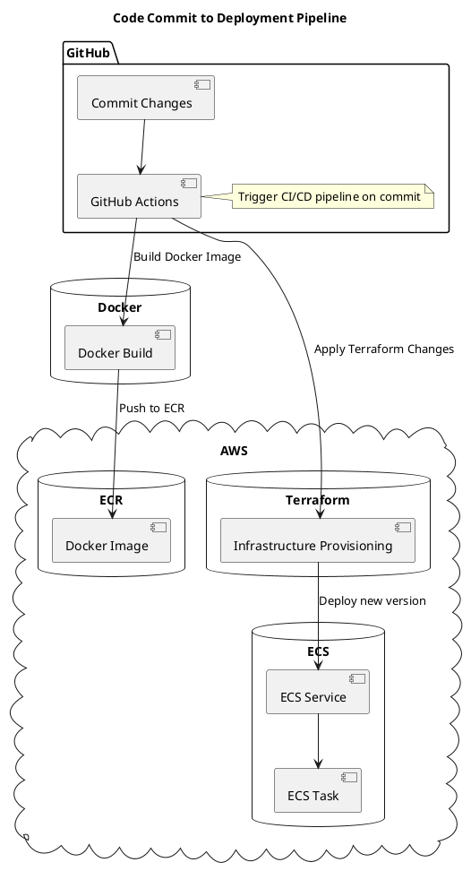
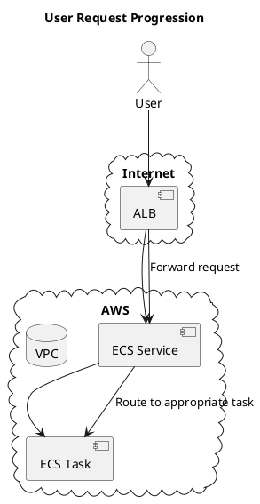
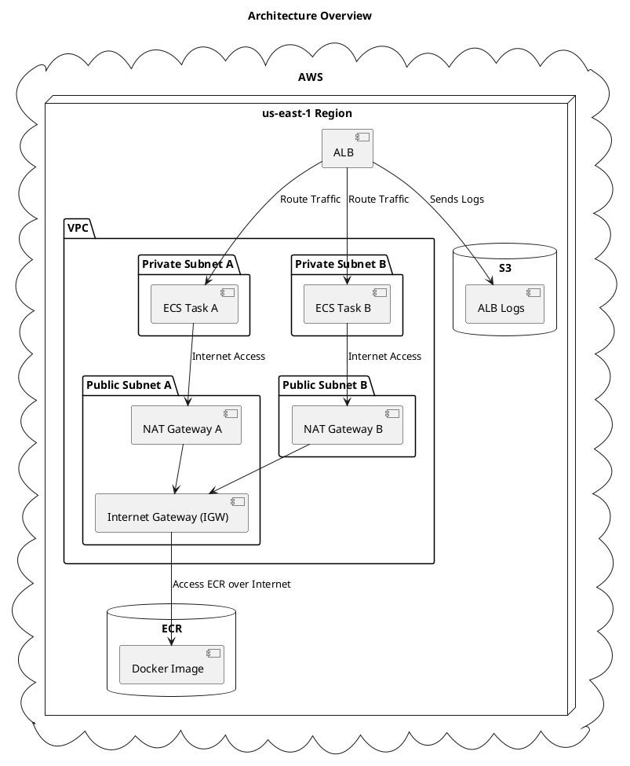

# Swoom Assigment Application Deployment

## Table of Contents
1. Introduction
2. Design and Architecture
3. Technology Decisions and Rationale
4. Installation Guide
5. Architecture Diagram
6. Conclusion

---

## 1. Introduction
Welcome to the Swoom Assignment Application deployment guide. This repository encapsulates a Flask-based web service, seamlessly containerized using Docker, and provisioned on AWS with infrastructure-as-code practices using Terraform and orchestrated through GitHub Actions.

---

## 2. Design and Architecture

The application is architected to be resilient, scalable, and maintainable. Key components include:
- **Application**: A Flask-based web service.
- **Containerization**: Docker ensures application consistency across environments.
- **Orchestration**: AWS ECS with Fargate for serverless container execution.
- **Load Balancing**: AWS Application Load Balancer distributes incoming traffic.
- **Infrastructure Management**: Terraform modules manage AWS resources, ensuring modular and reproducible infrastructure.
- **CI/CD**: GitHub Actions for automating build and deployment processes.

---

## 3. Technology Decisions and Rationale

### Terraform
- **Reproducibility**: Define infrastructure using a declarative language, minimizing drift and human error.
- **Extensive AWS Support**: Comprehensive coverage of AWS resources.
- **Modularity**: Clean separation of concerns using Terraform modules.

### Docker and AWS Fargate
- **Consistent Runtime**: Ensure the application environment is consistent.
- **Serverless Operation**: Remove the need to manage underlying EC2 instances.
- **Scalability**: Seamlessly scale with AWS ECS based on demand.

### Application Load Balancer (ALB)
- **High Availability**: Efficiently distribute traffic to maintain application responsiveness.
- **Secure Traffic Handling**: Integrated SSL/TLS termination.

---

## 4. Installation Guide

### Prerequisites:
- AWS CLI configured with necessary permissions.
- Terraform.
- Docker.
- Git.

### Step-by-step Deployment:

1. **Repository Setup**:
   ```bash
   git clone [https://github.com/charles-adedotun/swoom-assignment]
   cd swoom-assignment
   ```

2. **Docker Image Creation**:
   ```bash
   cd app
   docker build -t swoom-assignment-app .
   ```

3. **ECR Image Push**:
   - Set up an ECR repository named `swoom-assignment-app-repo`.
   - Authenticate Docker with ECR.
   - Push the Docker image.

4. **Terraform Deployment**:
   ```bash
   cd ../terraform
   terraform init
   terraform validate
   terraform plan
   terraform apply
   ```

5. **Validation**:
   - Access the AWS ECS dashboard.
   - Ensure `swoom-assignment-app-service` is active.
   - Test the application using the ALB's DNS name.

---

## 5. Architecture Diagram

### i. Progression from Code Commit to Deployment:



### ii. User Request Progression:




### iii. Architecture Overview:



<!--?xml version="1.0" encoding="us-ascii" standalone="no"?--><svg xmlns="http://www.w3.org/2000/svg" xmlns:xlink="http://www.w3.org/1999/xlink" contentstyletype="text/css" height="933px" preserveAspectRatio="none" style="width:815px;height:933px;background:#FFFFFF;" version="1.1" viewBox="0 0 815 933" width="815px" zoomAndPan="magnify"><defs></defs><g><text fill="#000000" font-family="sans-serif" font-size="14" font-weight="bold" lengthAdjust="spacing" textLength="179" x="311.2479" y="22.9951">Architecture Overview</text><!--cluster AWS--><g id="cluster_AWS"><path d="M52.9507,79.7029 C71.9121,57.7846 95.0793,57.8828 108.5067,85.8642 C121.2219,48.6954 154.5288,53.1179 173.7557,79.1404 C190.8763,49.1927 221.5465,51.2355 235.5975,82.254 C253.8491,57.0349 275.6141,53.4024 293.3133,82.8373 C309.5602,58.1045 327.7335,50.8487 349.0961,77.2573 C366.6196,49.884 387.6557,53.7506 405.9114,76.4261 C429.6418,43.2969 450.8,45.2948 470.559,80.1999 C487.0565,58.1608 509.8839,59.6546 520.6695,86.103 C538.7134,49.5259 560.0173,49.8456 584.9444,79.4146 C605.2612,58.549 628.6976,56.5306 640.752,88.1929 C656.8807,59.911 676.779,57.9427 697.0446,83.8993 C715.759,49.8434 746.1332,54.8987 762.2467,86.4829 C766.7314,88.098 767.2752,90.4959 763.8787,93.8555 C789.8139,108.349 790.0144,126.6816 767.0363,144.2405 C801.8201,157.1952 799.135,187.6305 772.3497,205.8916 C800.0926,221.316 797.3922,236.8898 776.2838,256.139 C805.7062,273.143 801.8605,300.6456 776.3855,317.7401 C799.7149,333.2853 805.2646,357.0603 775.776,372.0123 C805.9669,390.3122 807.4165,415.1125 776.4713,434.0971 C805.9168,446.7949 802.56,474.5555 780.1758,490.6485 C805.3631,505.3168 804.5932,529.1949 777.5399,541.1357 C808.182,562.0694 808.4958,580.381 777.1308,600.8901 C801.1343,615.7587 797.2915,640.9732 774.1049,653.1072 C797.126,671.5225 800.4324,695.7158 768.9214,709.0811 C797.2863,723.7678 798.5007,745.9964 774.4729,765.8102 C804.1345,787.8333 801.5893,810.7646 772.7692,831.2656 C794.1938,856.3048 783.1728,876.0279 755.2467,884.9629 C757.8138,882.4339 760.3489,883.5014 761.4732,886.5684 C747.0016,922.6683 720.7187,922.1901 699.1597,893.3714 C681.2116,917.6448 660.0588,917.355 645.9936,889.4174 C624.6942,921.4419 606.0404,921.3879 585.8337,888.4062 C570.7035,917.1105 546.3059,914.0925 529.9952,889.6463 C515.7939,923.5162 491.2575,924.7435 468.5519,898.3116 C450.8808,925.8789 419.1729,924.6257 402.9519,896.6004 C385.9163,924.0462 357.7563,921.3255 345.5525,891.7376 C327.2098,917.4625 307.2808,926.2053 285.3522,895.5677 C271.0539,918.9751 248.8682,919.8948 235.3869,894.7273 C213.6841,922.5215 189.7465,918.3862 174.4277,888.0344 C155.5274,915.4757 136.8549,922.9794 112.5792,893.9185 C81.9071,922.2296 58.2349,914.3788 42.2467,877.9629 C44.9242,878.9506 45.2334,881.4876 43.0654,883.2287 C16.1953,866.276 21.1323,846.4724 45.0041,831.4184 C16.4966,814.4042 16.0369,790.8849 45.2301,774.0982 C11.9847,754.6302 16.7604,734.4073 42.2347,712.1022 C14.6993,691.9733 21.4664,672.1588 45.4236,654.9007 C14.7587,644.8845 15.9141,622.5157 36.5774,603.6415 C13.1455,587.8485 6,566.6031 34.6496,548.9735 C12.3368,531.722 14.6805,504.4869 40.1583,491.8435 C12.8932,474.0269 13.3223,449.5198 39.0929,430.7778 C14.0496,412.2346 12.4197,390.5599 40.752,373.5645 C18.7714,360.8983 19.0874,335.6194 40.3821,322.6387 C8.4906,305.8835 12.3844,280.93 39.216,263.0261 C14.0007,247.7869 15.8601,223.0419 39.5359,208.0873 C10.3967,182.6466 18.5008,165.4089 48.3625,148.7439 C20.9579,124.281 16.306,103.1755 49.2467,79.4829 C50.6504,77.605 51.7659,77.8943 52.9507,79.7029 " fill="none" style="stroke:#181818;stroke-width:1.0;"></path><text fill="#000000" font-family="sans-serif" font-size="14" font-weight="bold" lengthAdjust="spacing" textLength="36" x="384.2467" y="97.478">AWS</text></g><!--cluster us-east-1 Region--><g id="cluster_us-east-1 Region"><polygon fill="none" points="58.2467,124.4829,68.2467,114.4829,746.2467,114.4829,746.2467,858.9629,736.2467,868.9629,58.2467,868.9629,58.2467,124.4829" style="stroke:#181818;stroke-width:1.0;"></polygon><line style="stroke:#181818;stroke-width:1.0;" x1="736.2467" x2="746.2467" y1="124.4829" y2="114.4829"></line><line style="stroke:#181818;stroke-width:1.0;" x1="58.2467" x2="736.2467" y1="124.4829" y2="124.4829"></line><line style="stroke:#181818;stroke-width:1.0;" x1="736.2467" x2="736.2467" y1="124.4829" y2="868.9629"></line><text fill="#000000" font-family="sans-serif" font-size="14" font-weight="bold" lengthAdjust="spacing" textLength="134" x="331.2467" y="140.478">us-east-1 Region</text></g><!--cluster VPC--><g id="cluster_VPC"><path d="M84.7467,263.7729 L117.7467,263.7729 A3.75,3.75 0 0 1 120.2467,266.2729 L127.2467,286.0698 L559.7467,286.0698 A2.5,2.5 0 0 1 562.2467,288.5698 L562.2467,681.1629 A2.5,2.5 0 0 1 559.7467,683.6629 L84.7467,683.6629 A2.5,2.5 0 0 1 82.2467,681.1629 L82.2467,266.2729 A2.5,2.5 0 0 1 84.7467,263.7729 " fill="none" style="stroke:#000000;stroke-width:1.5;"></path><line style="stroke:#000000;stroke-width:1.5;" x1="82.2467" x2="127.2467" y1="286.0698" y2="286.0698"></line><text fill="#000000" font-family="sans-serif" font-size="14" font-weight="bold" lengthAdjust="spacing" textLength="32" x="86.2467" y="278.768">VPC</text></g><!--cluster Public Subnet A--><g id="cluster_Public Subnet A"><path d="M108.7467,453.0729 L233.7467,453.0729 A3.75,3.75 0 0 1 236.2467,455.5729 L243.2467,475.3698 L333.7467,475.3698 A2.5,2.5 0 0 1 336.2467,477.8698 L336.2467,657.1629 A2.5,2.5 0 0 1 333.7467,659.6629 L108.7467,659.6629 A2.5,2.5 0 0 1 106.2467,657.1629 L106.2467,455.5729 A2.5,2.5 0 0 1 108.7467,453.0729 " fill="none" style="stroke:#000000;stroke-width:1.5;"></path><line style="stroke:#000000;stroke-width:1.5;" x1="106.2467" x2="243.2467" y1="475.3698" y2="475.3698"></line><text fill="#000000" font-family="sans-serif" font-size="14" font-weight="bold" lengthAdjust="spacing" textLength="124" x="110.2467" y="468.068">Public Subnet A</text></g><!--cluster Public Subnet B--><g id="cluster_Public Subnet B"><path d="M362.7467,453.0729 L486.7467,453.0729 A3.75,3.75 0 0 1 489.2467,455.5729 L496.2467,475.3698 L535.7467,475.3698 A2.5,2.5 0 0 1 538.2467,477.8698 L538.2467,547.8729 A2.5,2.5 0 0 1 535.7467,550.3729 L362.7467,550.3729 A2.5,2.5 0 0 1 360.2467,547.8729 L360.2467,455.5729 A2.5,2.5 0 0 1 362.7467,453.0729 " fill="none" style="stroke:#000000;stroke-width:1.5;"></path><line style="stroke:#000000;stroke-width:1.5;" x1="360.2467" x2="496.2467" y1="475.3698" y2="475.3698"></line><text fill="#000000" font-family="sans-serif" font-size="14" font-weight="bold" lengthAdjust="spacing" textLength="123" x="364.2467" y="468.068">Public Subnet B</text></g><!--cluster Private Subnet A--><g id="cluster_Private Subnet A"><path d="M173.7467,306.7729 L306.7467,306.7729 A3.75,3.75 0 0 1 309.2467,309.2729 L316.2467,329.0698 L318.7467,329.0698 A2.5,2.5 0 0 1 321.2467,331.5698 L321.2467,401.5729 A2.5,2.5 0 0 1 318.7467,404.0729 L173.7467,404.0729 A2.5,2.5 0 0 1 171.2467,401.5729 L171.2467,309.2729 A2.5,2.5 0 0 1 173.7467,306.7729 " fill="none" style="stroke:#000000;stroke-width:1.5;"></path><line style="stroke:#000000;stroke-width:1.5;" x1="171.2467" x2="316.2467" y1="329.0698" y2="329.0698"></line><text fill="#000000" font-family="sans-serif" font-size="14" font-weight="bold" lengthAdjust="spacing" textLength="132" x="175.2467" y="321.768">Private Subnet A</text></g><!--cluster Private Subnet B--><g id="cluster_Private Subnet B"><path d="M371.7467,306.7729 L503.7467,306.7729 A3.75,3.75 0 0 1 506.2467,309.2729 L513.2467,329.0698 L518.7467,329.0698 A2.5,2.5 0 0 1 521.2467,331.5698 L521.2467,401.5729 A2.5,2.5 0 0 1 518.7467,404.0729 L371.7467,404.0729 A2.5,2.5 0 0 1 369.2467,401.5729 L369.2467,309.2729 A2.5,2.5 0 0 1 371.7467,306.7729 " fill="none" style="stroke:#000000;stroke-width:1.5;"></path><line style="stroke:#000000;stroke-width:1.5;" x1="369.2467" x2="513.2467" y1="329.0698" y2="329.0698"></line><text fill="#000000" font-family="sans-serif" font-size="14" font-weight="bold" lengthAdjust="spacing" textLength="131" x="373.2467" y="321.768">Private Subnet B</text></g><!--cluster S3--><g id="cluster_S3"><path d="M586.2467,301.7729 C586.2467,291.7729 654.2467,291.7729 654.2467,291.7729 C654.2467,291.7729 722.2467,291.7729 722.2467,301.7729 L722.2467,394.0729 C722.2467,404.0729 654.2467,404.0729 654.2467,404.0729 C654.2467,404.0729 586.2467,404.0729 586.2467,394.0729 L586.2467,301.7729 " fill="none" style="stroke:#181818;stroke-width:1.0;"></path><path d="M586.2467,301.7729 C586.2467,311.7729 654.2467,311.7729 654.2467,311.7729 C654.2467,311.7729 722.2467,311.7729 722.2467,301.7729 " fill="none" style="stroke:#181818;stroke-width:1.0;"></path><text fill="#000000" font-family="sans-serif" font-size="14" font-weight="bold" lengthAdjust="spacing" textLength="20" x="644.2467" y="326.768">S3</text></g><!--cluster ECR--><g id="cluster_ECR"><path d="M137.2467,742.6629 C137.2467,732.6629 221.2467,732.6629 221.2467,732.6629 C221.2467,732.6629 305.2467,732.6629 305.2467,742.6629 L305.2467,834.9629 C305.2467,844.9629 221.2467,844.9629 221.2467,844.9629 C221.2467,844.9629 137.2467,844.9629 137.2467,834.9629 L137.2467,742.6629 " fill="none" style="stroke:#181818;stroke-width:1.0;"></path><path d="M137.2467,742.6629 C137.2467,752.6629 221.2467,752.6629 221.2467,752.6629 C221.2467,752.6629 305.2467,752.6629 305.2467,742.6629 " fill="none" style="stroke:#181818;stroke-width:1.0;"></path><text fill="#000000" font-family="sans-serif" font-size="14" font-weight="bold" lengthAdjust="spacing" textLength="30" x="206.2467" y="767.658">ECR</text></g><!--entity ALB--><g id="elem_ALB"><rect fill="#F1F1F1" height="46.2969" rx="2.5" ry="2.5" style="stroke:#181818;stroke-width:0.5;" width="66" x="412.2467" y="154.4829"></rect><rect fill="#F1F1F1" height="10" style="stroke:#181818;stroke-width:0.5;" width="15" x="458.2467" y="159.4829"></rect><rect fill="#F1F1F1" height="2" style="stroke:#181818;stroke-width:0.5;" width="4" x="456.2467" y="161.4829"></rect><rect fill="#F1F1F1" height="2" style="stroke:#181818;stroke-width:0.5;" width="4" x="456.2467" y="165.4829"></rect><text fill="#000000" font-family="sans-serif" font-size="14" lengthAdjust="spacing" textLength="26" x="427.2467" y="187.478">ALB</text></g><!--entity Internet Gateway (IGW)--><g id="elem_Internet Gateway (IGW)"><rect fill="#F1F1F1" height="46.2969" rx="2.5" ry="2.5" style="stroke:#181818;stroke-width:0.5;" width="198" x="122.2467" y="597.3729"></rect><rect fill="#F1F1F1" height="10" style="stroke:#181818;stroke-width:0.5;" width="15" x="300.2467" y="602.3729"></rect><rect fill="#F1F1F1" height="2" style="stroke:#181818;stroke-width:0.5;" width="4" x="298.2467" y="604.3729"></rect><rect fill="#F1F1F1" height="2" style="stroke:#181818;stroke-width:0.5;" width="4" x="298.2467" y="608.3729"></rect><text fill="#000000" font-family="sans-serif" font-size="14" lengthAdjust="spacing" textLength="158" x="137.2467" y="630.368">Internet Gateway (IGW)</text></g><!--entity NAT Gateway A--><g id="elem_NAT Gateway A"><rect fill="#F1F1F1" height="46.2969" rx="2.5" ry="2.5" style="stroke:#181818;stroke-width:0.5;" width="144" x="167.2467" y="488.0729"></rect><rect fill="#F1F1F1" height="10" style="stroke:#181818;stroke-width:0.5;" width="15" x="291.2467" y="493.0729"></rect><rect fill="#F1F1F1" height="2" style="stroke:#181818;stroke-width:0.5;" width="4" x="289.2467" y="495.0729"></rect><rect fill="#F1F1F1" height="2" style="stroke:#181818;stroke-width:0.5;" width="4" x="289.2467" y="499.0729"></rect><text fill="#000000" font-family="sans-serif" font-size="14" lengthAdjust="spacing" textLength="104" x="182.2467" y="521.068">NAT Gateway A</text></g><!--entity NAT Gateway B--><g id="elem_NAT Gateway B"><rect fill="#F1F1F1" height="46.2969" rx="2.5" ry="2.5" style="stroke:#181818;stroke-width:0.5;" width="145" x="376.7467" y="488.0729"></rect><rect fill="#F1F1F1" height="10" style="stroke:#181818;stroke-width:0.5;" width="15" x="501.7467" y="493.0729"></rect><rect fill="#F1F1F1" height="2" style="stroke:#181818;stroke-width:0.5;" width="4" x="499.7467" y="495.0729"></rect><rect fill="#F1F1F1" height="2" style="stroke:#181818;stroke-width:0.5;" width="4" x="499.7467" y="499.0729"></rect><text fill="#000000" font-family="sans-serif" font-size="14" lengthAdjust="spacing" textLength="105" x="391.7467" y="521.068">NAT Gateway B</text></g><!--entity ECS Task A--><g id="elem_ECS Task A"><rect fill="#F1F1F1" height="46.2969" rx="2.5" ry="2.5" style="stroke:#181818;stroke-width:0.5;" width="118" x="187.2467" y="341.7729"></rect><rect fill="#F1F1F1" height="10" style="stroke:#181818;stroke-width:0.5;" width="15" x="285.2467" y="346.7729"></rect><rect fill="#F1F1F1" height="2" style="stroke:#181818;stroke-width:0.5;" width="4" x="283.2467" y="348.7729"></rect><rect fill="#F1F1F1" height="2" style="stroke:#181818;stroke-width:0.5;" width="4" x="283.2467" y="352.7729"></rect><text fill="#000000" font-family="sans-serif" font-size="14" lengthAdjust="spacing" textLength="78" x="202.2467" y="374.768">ECS Task A</text></g><!--entity ECS Task B--><g id="elem_ECS Task B"><rect fill="#F1F1F1" height="46.2969" rx="2.5" ry="2.5" style="stroke:#181818;stroke-width:0.5;" width="119" x="385.7467" y="341.7729"></rect><rect fill="#F1F1F1" height="10" style="stroke:#181818;stroke-width:0.5;" width="15" x="484.7467" y="346.7729"></rect><rect fill="#F1F1F1" height="2" style="stroke:#181818;stroke-width:0.5;" width="4" x="482.7467" y="348.7729"></rect><rect fill="#F1F1F1" height="2" style="stroke:#181818;stroke-width:0.5;" width="4" x="482.7467" y="352.7729"></rect><text fill="#000000" font-family="sans-serif" font-size="14" lengthAdjust="spacing" textLength="79" x="400.7467" y="374.768">ECS Task B</text></g><!--entity ALB Logs--><g id="elem_ALB Logs"><rect fill="#F1F1F1" height="46.2969" rx="2.5" ry="2.5" style="stroke:#181818;stroke-width:0.5;" width="103" x="602.7467" y="341.7729"></rect><rect fill="#F1F1F1" height="10" style="stroke:#181818;stroke-width:0.5;" width="15" x="685.7467" y="346.7729"></rect><rect fill="#F1F1F1" height="2" style="stroke:#181818;stroke-width:0.5;" width="4" x="683.7467" y="348.7729"></rect><rect fill="#F1F1F1" height="2" style="stroke:#181818;stroke-width:0.5;" width="4" x="683.7467" y="352.7729"></rect><text fill="#000000" font-family="sans-serif" font-size="14" lengthAdjust="spacing" textLength="63" x="617.7467" y="374.768">ALB Logs</text></g><!--entity Docker Image--><g id="elem_Docker Image"><rect fill="#F1F1F1" height="46.2969" rx="2.5" ry="2.5" style="stroke:#181818;stroke-width:0.5;" width="136" x="153.2467" y="782.6629"></rect><rect fill="#F1F1F1" height="10" style="stroke:#181818;stroke-width:0.5;" width="15" x="269.2467" y="787.6629"></rect><rect fill="#F1F1F1" height="2" style="stroke:#181818;stroke-width:0.5;" width="4" x="267.2467" y="789.6629"></rect><rect fill="#F1F1F1" height="2" style="stroke:#181818;stroke-width:0.5;" width="4" x="267.2467" y="793.6629"></rect><text fill="#000000" font-family="sans-serif" font-size="14" lengthAdjust="spacing" textLength="96" x="168.2467" y="815.658">Docker Image</text></g><!--link ECS Task A to NAT Gateway A--><g id="link_ECS Task A_NAT Gateway A"><path d="M245.1567,388.4729 C243.9267,413.6729 241.9467,454.5229 240.6267,481.8729 " fill="none" id="ECS Task A-to-NAT Gateway A" style="stroke:#181818;stroke-width:1.0;"></path><polygon fill="#181818" points="240.3367,486.8329,244.7686,478.0376,240.5792,481.8388,236.778,477.6494,240.3367,486.8329" style="stroke:#181818;stroke-width:1.0;"></polygon><text fill="#000000" font-family="sans-serif" font-size="13" lengthAdjust="spacing" textLength="99" x="244.2467" y="433.1398">Internet Access</text></g><!--link ECS Task B to NAT Gateway B--><g id="link_ECS Task B_NAT Gateway B"><path d="M445.8667,388.4729 C446.5667,413.6729 447.7067,454.5229 448.4567,481.8729 " fill="none" id="ECS Task B-to-NAT Gateway B" style="stroke:#181818;stroke-width:1.0;"></path><polygon fill="#181818" points="448.6267,486.8329,452.368,477.7223,448.4839,481.8349,444.3713,477.9508,448.6267,486.8329" style="stroke:#181818;stroke-width:1.0;"></polygon><text fill="#000000" font-family="sans-serif" font-size="13" lengthAdjust="spacing" textLength="99" x="447.2467" y="433.1398">Internet Access</text></g><!--link NAT Gateway A to Internet Gateway (IGW)--><g id="link_NAT Gateway A_Internet Gateway (IGW)"><path d="M235.4767,534.7129 C232.7167,551.1629 228.9467,573.6029 225.9867,591.2629 " fill="none" id="NAT Gateway A-to-Internet Gateway (IGW)" style="stroke:#181818;stroke-width:1.0;"></path><polygon fill="#181818" points="225.0167,596.0529,230.4534,587.8406,225.8456,591.1221,222.5641,586.5143,225.0167,596.0529" style="stroke:#181818;stroke-width:1.0;"></polygon></g><!--link NAT Gateway B to Internet Gateway (IGW)--><g id="link_NAT Gateway B_Internet Gateway (IGW)"><path d="M401.1767,534.8429 C364.0367,552.3229 312.6767,576.4929 274.3367,594.5329 " fill="none" id="NAT Gateway B-to-Internet Gateway (IGW)" style="stroke:#181818;stroke-width:1.0;"></path><polygon fill="#181818" points="270.2567,596.9229,280.1033,596.7145,274.7817,594.796,276.7002,589.4744,270.2567,596.9229" style="stroke:#181818;stroke-width:1.0;"></polygon></g><!--link ALB to ECS Task A--><g id="link_ALB_ECS Task A"><path d="M412.1467,194.4429 C394.5667,203.6929 373.1567,216.3829 356.2467,230.7729 C318.9067,262.5629 284.3867,308.0729 264.3167,336.8029 " fill="none" id="ALB-to-ECS Task A" style="stroke:#181818;stroke-width:1.0;"></path><polygon fill="#181818" points="260.9767,340.6129,269.3957,335.5022,263.8286,336.5061,262.8247,330.939,260.9767,340.6129" style="stroke:#181818;stroke-width:1.0;"></polygon><text fill="#000000" font-family="sans-serif" font-size="13" lengthAdjust="spacing" textLength="79" x="357.2467" y="243.8398">Route Traffic</text></g><!--link ALB to ECS Task B--><g id="link_ALB_ECS Task B"><path d="M445.2467,200.9829 C445.2467,234.7829 445.2467,298.8829 445.2467,335.8129 " fill="none" id="ALB-to-ECS Task B" style="stroke:#181818;stroke-width:1.0;"></path><polygon fill="#181818" points="445.2467,340.4929,449.2467,331.4929,445.2467,335.4929,441.2467,331.4929,445.2467,340.4929" style="stroke:#181818;stroke-width:1.0;"></polygon><text fill="#000000" font-family="sans-serif" font-size="13" lengthAdjust="spacing" textLength="79" x="446.2467" y="243.8398">Route Traffic</text></g><!--link ALB to ALB Logs--><g id="link_ALB_ALB Logs"><path d="M478.5267,194.9629 C495.9567,204.2829 517.1667,216.8629 534.2467,230.7729 C573.8667,263.0529 612.0367,308.7129 634.3067,337.2929 " fill="none" id="ALB-to-ALB Logs" style="stroke:#181818;stroke-width:1.0;"></path><polygon fill="#181818" points="637.7467,340.7329,635.4098,331.1653,634.6898,336.7762,629.079,336.0562,637.7467,340.7329" style="stroke:#181818;stroke-width:1.0;"></polygon><text fill="#000000" font-family="sans-serif" font-size="13" lengthAdjust="spacing" textLength="74" x="553.2467" y="243.8398">Sends Logs</text></g><!--link Internet Gateway (IGW) to Docker Image--><g id="link_Internet Gateway (IGW)_Docker Image"><path d="M221.2467,643.9929 C221.2467,677.4729 221.2467,740.4129 221.2467,776.8329 " fill="none" id="Internet Gateway (IGW)-to-Docker Image" style="stroke:#181818;stroke-width:1.0;"></path><polygon fill="#181818" points="221.2467,781.4429,225.2467,772.4429,221.2467,776.4429,217.2467,772.4429,221.2467,781.4429" style="stroke:#181818;stroke-width:1.0;"></polygon><text fill="#000000" font-family="sans-serif" font-size="13" lengthAdjust="spacing" textLength="160" x="222.2467" y="712.7298">Access ECR over Internet</text></g><!--SRC=[XP5DRuCm38Rl-HKMf-t0OTgDmwJGLLMbQgjAjHwg7jBWigWTcP90DKtzxmk4KRvAkG2styVsQoFC2O4g_YaCSfCfXFSSLIxmJ0W_oIm6ZsuY3tu9G2fZ12_JFZ9j_2TOOI9aMkHi4k2RyIDBRCN7Sb876-5bjZy93b6sJz40TKptREUfGLM4PypWcVt0mtosUTnT2zxekixH__ZbJe-mrQE924SGIkIsQdZEwII2DTF7qHdQW70Oq9Z0lKc_1VZ-ItTr2A0sYtAEMfC-kYyCXuHaq5md7hz8bpqg8GsVjdHHRLv-EM5ZvG1MChFchHKx70I_MHdsAilIc1csPzfU8Ng- -bu0O24JlUkDuh1rFe08qrYNFrtYTB9g85ybFwA2-PUzUHjxmmRNgIKBgaE0HOFCYtYbBL0NSla3]--></g></svg>


---

## 6. Conclusion
This deployment strategy ensures the Swoom application is robust, agile, and cloud-native. Leveraging best practices with Terraform and AWS, I've crafted an infrastructure that can evolve with the application's needs. I'm confident this approach not only meets the current requirements but sets a solid foundation for future expansions.
