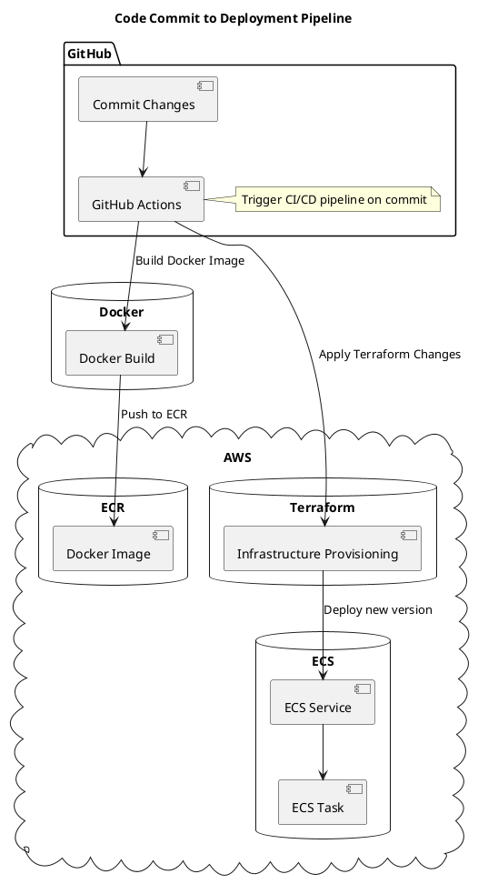
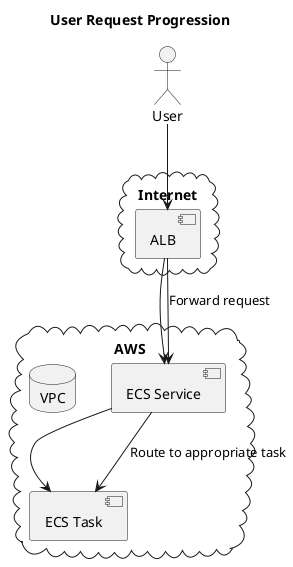

# Swoom Assigment Application Deployment

## Table of Contents
1. Introduction
2. Design and Architecture
3. Technology Decisions and Rationale
4. Installation Guide
5. Architecture Diagram
6. Conclusion

---

## 1. Introduction
Welcome to the Swoom Assignment Application deployment guide. This repository encapsulates a Flask-based web service, seamlessly containerized using Docker, and provisioned on AWS with infrastructure-as-code practices using Terraform and orchestrated through GitHub Actions.

---

## 2. Design and Architecture

The application is architected to be resilient, scalable, and maintainable. Key components include:
- **Application**: A Flask-based web service.
- **Containerization**: Docker ensures application consistency across environments.
- **Orchestration**: AWS ECS with Fargate for serverless container execution.
- **Load Balancing**: AWS Application Load Balancer distributes incoming traffic.
- **Infrastructure Management**: Terraform modules manage AWS resources, ensuring modular and reproducible infrastructure.
- **CI/CD**: GitHub Actions for automating build and deployment processes.

---

## 3. Technology Decisions and Rationale

### Terraform
- **Reproducibility**: Define infrastructure using a declarative language, minimizing drift and human error.
- **Extensive AWS Support**: Comprehensive coverage of AWS resources.
- **Modularity**: Clean separation of concerns using Terraform modules.

### Docker and AWS Fargate
- **Consistent Runtime**: Ensure the application environment is consistent.
- **Serverless Operation**: Remove the need to manage underlying EC2 instances.
- **Scalability**: Seamlessly scale with AWS ECS based on demand.

### Application Load Balancer (ALB)
- **High Availability**: Efficiently distribute traffic to maintain application responsiveness.
- **Secure Traffic Handling**: Integrated SSL/TLS termination.

---

## 4. Installation Guide

### Prerequisites:
- AWS CLI configured with necessary permissions.
- Terraform.
- Docker.
- Git.

### Step-by-step Deployment:

1. **Repository Setup**:
   ```bash
   git clone [https://github.com/charles-adedotun/swoom-assignment]
   cd swoom-assignment
   ```

2. **Docker Image Creation**:
   ```bash
   cd app
   docker build -t swoom-assignment-app .
   ```

3. **ECR Image Push**:
   - Set up an ECR repository named `swoom-assignment-app-repo`.
   - Authenticate Docker with ECR.
   - Push the Docker image.

4. **Terraform Deployment**:
   ```bash
   cd ../terraform
   terraform init
   terraform validate
   terraform plan
   terraform apply
   ```

5. **Validation**:
   - Access the AWS ECS dashboard.
   - Ensure `swoom-assignment-app-service` is active.
   - Test the application using the ALB's DNS name.

---

## 5. Architecture Diagram

### i. Progression from Code Commit to Deployment:



### ii. User Request Progression
![Uploading chatuml-diagr<!--?xml version="1.0" encoding="us-ascii" standalone="no"?--><svg xmlns="http://www.w3.org/2000/svg" xmlns:xlink="http://www.w3.org/1999/xlink" contentstyletype="text/css" height="546px" preserveAspectRatio="none" style="width:307px;height:546px;background:#FFFFFF;" version="1.1" viewBox="0 0 307 546" width="307px" zoomAndPan="magnify"><defs></defs><g><text fill="#000000" font-family="sans-serif" font-size="14" font-weight="bold" lengthAdjust="spacing" textLength="208" x="42.6288" y="22.9951">User Request Progression</text><!--cluster Internet--><g id="cluster_Internet"><path d="M136.2199,174.9055 C139.2447,167.2249 144.5633,168.1668 149.2941,173.1431 C154.546,167.0313 159.6268,165.3884 164.4066,173.6398 C167.7506,167.9382 173.0825,167.0667 177.1959,172.7776 C182.1493,167.259 187.3557,166.4535 191.2502,173.9233 C194.3575,167.8369 200.1235,167.3186 203.7051,173.4394 C209.6392,167.2392 214.1748,168.0741 218.1926,175.4799 C225.3988,178.8639 226.7345,183.8177 220.1673,189.1861 C227.6155,189.9517 228.9331,196.1505 224.5367,201.2176 C232.5786,203.7017 232.9883,210.4712 227.4677,215.7001 C232.7147,221.2963 231.8908,226.2337 224.49,228.9977 C230.7826,234.6821 228.8473,240.525 221.7644,243.7358 C226.3018,249.1586 224.5521,254.2979 217.6359,255.8016 C215.2325,262.706 210.8588,263.7812 205.5973,258.6635 C203.4316,268.0357 196.1339,268.4132 189.9496,262.883 C186.1743,269.7364 181.902,270.4267 176.3618,264.8054 C170.9374,269.3709 166.8699,270.0153 163.8699,262.3328 C158.2448,268.5989 151.6921,267.1883 149.8017,258.7578 C143.5578,264.7392 139.1072,263.7555 135.6877,255.8809 C129.7754,252.7838 128.8521,247.3697 134.7626,243.3965 C127.7613,241.0435 126.973,235.2552 131.6889,230.1776 C123.7465,226.7093 123.8337,220.706 129.7737,215.4343 C124.9144,209.4357 125.5101,205.3588 133.156,202.675 C126.0348,198.3252 126.2824,191.6628 134.2208,188.4395 C127.3667,183.5419 128.6542,177.6731 136.2199,174.9055 " fill="none" style="stroke:#181818;stroke-width:1.0;"></path><text fill="#000000" font-family="sans-serif" font-size="14" font-weight="bold" lengthAdjust="spacing" textLength="63" x="144.7576" y="192.092">Internet</text></g><!--cluster AWS--><g id="cluster_AWS"><path d="M31.8273,322.9893 C35.3347,314.7708 40.2493,312.5419 47.3422,319.2666 C51.396,310.5502 59.3371,310.7566 63.9159,318.7457 C68.3941,312.9928 74.316,313.0255 78.425,319.195 C81.7352,310.9838 87.9005,311.1892 93.2937,316.9837 C95.9515,309.3821 100.2053,308.1932 106.2513,313.6118 C111.0303,305.3987 119.096,306.1136 123.3662,314.1479 C127.1203,307.6998 132.2482,304.9433 137.8095,312.2504 C142.8351,304.6186 147.4958,305.8857 152.1387,312.6318 C157.5701,305.8559 162.1438,308.123 165.9601,314.3487 C171.4547,308.9375 178.0197,309.6478 181.3309,316.9819 C186.5097,310.7644 193.1756,310.4702 196.5058,318.8974 C200.2455,311.1942 206.8052,310.5593 211.2571,318.2132 C217.2877,309.9301 223.4666,311.5746 227.6413,320.0299 C236.5701,313.0669 245.2006,316.0621 247.2576,327.3969 C248.6859,326.7128 249.6611,326.8682 249.8024,328.6992 C257.0335,334.4483 258.2004,341.1471 248.9462,346.0843 C256.6244,349.2319 256.7087,354.0763 251.0683,359.3538 C257.7472,363.835 258.901,371.0559 251.1909,375.6453 C259.4064,379.4903 261.343,387.3915 253.305,393.1945 C259.2266,397.9486 258.1006,403.6219 251.8395,407.0912 C261.2821,410.7234 261.3011,417.0326 254.1897,423.0957 C262.8017,429.5401 262.1222,436.3994 252.2589,440.8325 C259.2114,445.1381 260.2301,449.229 253.3708,454.6464 C261.2391,461.9924 258.403,467.2943 250.4209,471.9359 C256.4942,477.6602 257.2123,482.8805 249.5472,487.8506 C256.675,494.0196 257.8502,499.9282 248.239,504.8056 C255.9995,515.3529 253.6276,522.7964 240.2576,524.9869 C241.9188,524.2268 242.9925,524.9819 242.7485,526.8161 C237.7867,532.8386 231.8717,533.1662 227.5776,526.0454 C224.442,533.6872 218.4337,535.9257 212.3387,529.1799 C207.7726,535.6351 201.2484,536.2525 197.7085,528.1487 C193.1781,535.2002 186.9788,537.1523 181.187,529.5731 C176.5007,536.6153 172.1176,537.4011 166.6274,530.4071 C163.6543,536.7912 157.7415,537.0285 153.3955,531.9987 C147.7323,539.5642 141.3043,539.1358 137.0077,530.6072 C132.7153,538.2092 125.7825,537.4323 122.2209,529.8935 C117.6932,536.5541 113.2747,536.0224 108.5062,530.1571 C101.923,537.7076 95.8928,537.3256 91.3908,528.0412 C88.0783,535.1516 83.4374,534.5092 79.0229,529.1326 C73.4442,537.1966 67.1059,535.7038 62.8401,527.802 C58.3548,534.1682 50.3533,535.299 47.019,526.5937 C35.5072,533.3087 27.4912,533.1642 24.2576,517.9869 C25.0593,517.1224 25.9645,517.1573 26.449,518.3283 C19.1351,516.3984 16.9166,510.4916 22.8589,504.9929 C15.2683,500.8897 14.2732,493.166 22.593,488.8016 C12.576,484.5392 12.8263,477.5553 19.9333,470.7676 C11.8073,467.4542 9.2635,461.3731 16.1283,454.5438 C7.9312,450.5792 8.4638,444.9728 14.7831,439.6933 C6,435.6641 6.6253,429.1513 13.7801,424.0972 C6.1289,419.1314 6.9361,414.1211 14.3334,409.735 C6.9909,402.5146 7.0768,397.0338 16.4704,391.8085 C10.4737,385.4523 11.0662,380.0513 19.1931,376.151 C12.9192,369.6492 14.8495,364.2885 22.3629,360.5964 C14.7312,356.156 16.2011,349.0331 23.5567,345.802 C13.0505,335.266 18.4416,323.8635 31.2576,320.3969 C32.5124,320.8836 32.7658,322.0206 31.8273,322.9893 " fill="none" style="stroke:#181818;stroke-width:1.0;"></path><text fill="#000000" font-family="sans-serif" font-size="14" font-weight="bold" lengthAdjust="spacing" textLength="36" x="117.7576" y="338.392">AWS</text></g><!--entity ALB--><g id="elem_ALB"><rect fill="#F1F1F1" height="46.2969" rx="2.5" ry="2.5" style="stroke:#181818;stroke-width:0.5;" width="66" x="143.2576" y="201.0969"></rect><rect fill="#F1F1F1" height="10" style="stroke:#181818;stroke-width:0.5;" width="15" x="189.2576" y="206.0969"></rect><rect fill="#F1F1F1" height="2" style="stroke:#181818;stroke-width:0.5;" width="4" x="187.2576" y="208.0969"></rect><rect fill="#F1F1F1" height="2" style="stroke:#181818;stroke-width:0.5;" width="4" x="187.2576" y="212.0969"></rect><text fill="#000000" font-family="sans-serif" font-size="14" lengthAdjust="spacing" textLength="26" x="158.2576" y="234.092">ALB</text></g><!--entity ECS Service--><g id="elem_ECS Service"><rect fill="#F1F1F1" height="46.2969" rx="2.5" ry="2.5" style="stroke:#181818;stroke-width:0.5;" width="122" x="115.2576" y="347.3969"></rect><rect fill="#F1F1F1" height="10" style="stroke:#181818;stroke-width:0.5;" width="15" x="217.2576" y="352.3969"></rect><rect fill="#F1F1F1" height="2" style="stroke:#181818;stroke-width:0.5;" width="4" x="215.2576" y="354.3969"></rect><rect fill="#F1F1F1" height="2" style="stroke:#181818;stroke-width:0.5;" width="4" x="215.2576" y="358.3969"></rect><text fill="#000000" font-family="sans-serif" font-size="14" lengthAdjust="spacing" textLength="82" x="130.2576" y="380.392">ECS Service</text></g><!--entity ECS Task--><g id="elem_ECS Task"><rect fill="#F1F1F1" height="46.2969" rx="2.5" ry="2.5" style="stroke:#181818;stroke-width:0.5;" width="105" x="31.7576" y="470.6869"></rect><rect fill="#F1F1F1" height="10" style="stroke:#181818;stroke-width:0.5;" width="15" x="116.7576" y="475.6869"></rect><rect fill="#F1F1F1" height="2" style="stroke:#181818;stroke-width:0.5;" width="4" x="114.7576" y="477.6869"></rect><rect fill="#F1F1F1" height="2" style="stroke:#181818;stroke-width:0.5;" width="4" x="114.7576" y="481.6869"></rect><text fill="#000000" font-family="sans-serif" font-size="14" lengthAdjust="spacing" textLength="65" x="46.7576" y="503.682">ECS Task</text></g><!--entity VPC--><g id="elem_VPC"><path d="M32.2576,357.8969 C32.2576,347.8969 56.2576,347.8969 56.2576,347.8969 C56.2576,347.8969 80.2576,347.8969 80.2576,357.8969 L80.2576,383.1937 C80.2576,393.1937 56.2576,393.1937 56.2576,393.1937 C56.2576,393.1937 32.2576,393.1937 32.2576,383.1937 L32.2576,357.8969 " fill="#F1F1F1" style="stroke:#181818;stroke-width:0.5;"></path><path d="M32.2576,357.8969 C32.2576,367.8969 56.2576,367.8969 56.2576,367.8969 C56.2576,367.8969 80.2576,367.8969 80.2576,357.8969 " fill="none" style="stroke:#181818;stroke-width:0.5;"></path><text fill="#000000" font-family="sans-serif" font-size="14" lengthAdjust="spacing" textLength="28" x="42.2576" y="384.892">VPC</text></g><!--entity User--><g id="elem_User"><ellipse cx="176.2576" cy="51.2969" fill="#F1F1F1" rx="8" ry="8" style="stroke:#181818;stroke-width:0.5;"></ellipse><path d="M176.2576,59.2969 L176.2576,86.2969 M163.2576,67.2969 L189.2576,67.2969 M176.2576,86.2969 L163.2576,101.2969 M176.2576,86.2969 L189.2576,101.2969 " fill="none" style="stroke:#181818;stroke-width:0.5;"></path><text fill="#000000" font-family="sans-serif" font-size="14" lengthAdjust="spacing" textLength="32" x="160.2576" y="115.792">User</text></g><!--link User to ALB--><g id="link_User_ALB"><path d="M176.2576,119.4369 C176.2576,143.0569 176.2576,173.0669 176.2576,194.7369 " fill="none" id="User-to-ALB" style="stroke:#181818;stroke-width:1.0;"></path><polygon fill="#181818" points="176.2576,199.6169,180.2576,190.6169,176.2576,194.6169,172.2576,190.6169,176.2576,199.6169" style="stroke:#181818;stroke-width:1.0;"></polygon></g><!--link ALB to ECS Service--><g id="link_ALB_ECS Service"><path d="M172.6776,247.8369 C171.3176,257.5269 169.9276,268.9869 169.2576,279.3969 C167.9276,300.0869 169.8276,323.4169 171.9876,341.1669 " fill="none" id="ALB-to-ECS Service" style="stroke:#181818;stroke-width:1.0;"></path><polygon fill="#181818" points="172.7276,345.9569,175.5637,336.5252,172.0986,340.9966,167.6272,337.5315,172.7276,345.9569" style="stroke:#181818;stroke-width:1.0;"></polygon></g><!--link ALB to ECS Service--><g id="link_ALB_ECS Service"><path d="M176.2576,247.7869 C176.2576,272.9969 176.2576,313.8469 176.2576,341.1969 " fill="none" id="ALB-to-ECS Service-1" style="stroke:#181818;stroke-width:1.0;"></path><polygon fill="#181818" points="176.2576,346.1569,180.2576,337.1569,176.2576,341.1569,172.2576,337.1569,176.2576,346.1569" style="stroke:#181818;stroke-width:1.0;"></polygon><text fill="#000000" font-family="sans-serif" font-size="13" lengthAdjust="spacing" textLength="103" x="177.2576" y="292.4638">Forward request</text></g><!--link ECS Service to ECS Task--><g id="link_ECS Service_ECS Task"><path d="M115.0376,391.1069 C80.4376,402.7769 43.1176,416.6569 38.2576,423.6869 C28.5976,437.6669 37.5776,453.4169 50.0776,466.3569 " fill="none" id="ECS Service-to-ECS Task" style="stroke:#181818;stroke-width:1.0;"></path><polygon fill="#181818" points="53.0476,469.2769,49.4564,460.1061,49.4907,465.7628,43.834,465.7971,53.0476,469.2769" style="stroke:#181818;stroke-width:1.0;"></polygon></g><!--link ECS Service to ECS Task--><g id="link_ECS Service_ECS Task"><path d="M159.1676,394.0769 C143.8076,414.3269 121.2076,444.1169 104.8576,465.6869 " fill="none" id="ECS Service-to-ECS Task-1" style="stroke:#181818;stroke-width:1.0;"></path><polygon fill="#181818" points="101.2576,469.4269,109.8876,464.681,104.2827,465.4458,103.5178,459.8409,101.2576,469.4269" style="stroke:#181818;stroke-width:1.0;"></polygon><text fill="#000000" font-family="sans-serif" font-size="13" lengthAdjust="spacing" textLength="163" x="136.2576" y="436.7538">Route to appropriate task</text></g><!--SRC=[VO-x2i9044Nx_OeXVNuWXH23Wc0H4X-5f1YJGHP39ivEj93yksuMV1HQNiwPUncrsX9i7GaKT1d8AUJ29o7dB7V6OAqi4pUcRdbe85frIjAHHd0t44xZU0Q7T3slpFZIqdqPZ0a4PP6LK99SRKsL9v_vRMpGdJrkKF68ZY3QvLdeWczZz7i_-XDOijnG6f3mcFatbq31Wn8e0_QzS2yMVNoo1m00]--></g></svg>am (1).svg…]()



---

## 6. Conclusion
This deployment strategy ensures the Swoom application is robust, agile, and cloud-native. Leveraging best practices with Terraform and AWS, I've crafted an infrastructure that can evolve with the application's needs. I'm confident this approach not only meets the current requirements but sets a solid foundation for future expansions.
