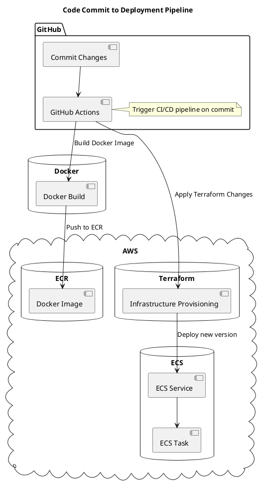
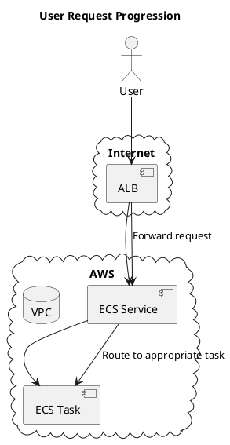

# Swoom Assigment Application Deployment

## Table of Contents
1. Introduction
2. Design and Architecture
3. Technology Decisions and Rationale
4. Installation Guide
5. Architecture Diagram
6. Conclusion

---

## 1. Introduction
Welcome to the Swoom Assignment Application deployment guide. This repository encapsulates a Flask-based web service, seamlessly containerized using Docker, and provisioned on AWS with infrastructure-as-code practices using Terraform and orchestrated through GitHub Actions.

---

## 2. Design and Architecture

The application is architected to be resilient, scalable, and maintainable. Key components include:
- **Application**: A Flask-based web service.
- **Containerization**: Docker ensures application consistency across environments.
- **Orchestration**: AWS ECS with Fargate for serverless container execution.
- **Load Balancing**: AWS Application Load Balancer distributes incoming traffic.
- **Infrastructure Management**: Terraform modules manage AWS resources, ensuring modular and reproducible infrastructure.
- **CI/CD**: GitHub Actions for automating build and deployment processes.

---

## 3. Technology Decisions and Rationale

### Terraform
- **Reproducibility**: Define infrastructure using a declarative language, minimizing drift and human error.
- **Extensive AWS Support**: Comprehensive coverage of AWS resources.
- **Modularity**: Clean separation of concerns using Terraform modules.

### Docker and AWS Fargate
- **Consistent Runtime**: Ensure the application environment is consistent.
- **Serverless Operation**: Remove the need to manage underlying EC2 instances.
- **Scalability**: Seamlessly scale with AWS ECS based on demand.

### Application Load Balancer (ALB)
- **High Availability**: Efficiently distribute traffic to maintain application responsiveness.
- **Secure Traffic Handling**: Integrated SSL/TLS termination.

---

## 4. Installation Guide

### Prerequisites:
- AWS CLI configured with necessary permissions.
- Terraform.
- Docker.
- Git.

### Step-by-step Deployment:

1. **Repository Setup**:
   ```bash
   git clone [https://github.com/charles-adedotun/swoom-assignment]
   cd swoom-assignment
   ```

2. **Docker Image Creation**:
   ```bash
   cd app
   docker build -t swoom-assignment-app .
   ```

3. **ECR Image Push**:
   - Set up an ECR repository named `swoom-assignment-app-repo`.
   - Authenticate Docker with ECR.
   - Push the Docker image.

4. **Terraform Deployment**:
   ```bash
   cd ../terraform
   terraform init
   terraform validate
   terraform plan
   terraform apply
   ```

5. **Validation**:
   - Access the AWS ECS dashboard.
   - Ensure `swoom-assignment-app-service` is active.
   - Test the application using the ALB's DNS name.

---

## 5. Architecture Diagram

### i. Progression from Code Commit to Deployment:



### ii. User Request Progression




---

## 6. Conclusion
This deployment strategy ensures the Swoom application is robust, agile, and cloud-native. Leveraging best practices with Terraform and AWS, I've crafted an infrastructure that can evolve with the application's needs. I'm confident this approach not only meets the current requirements but sets a solid foundation for future expansions.
